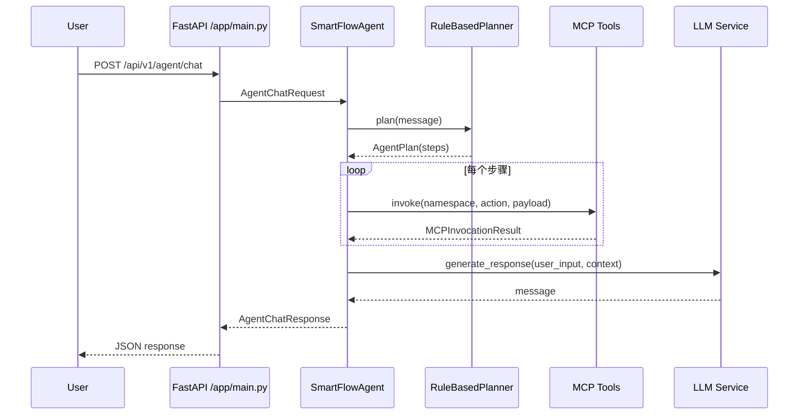

# C-SmartFlow Agent + MCP 设计说明

## 目标

- 为 HR/IT/财务/新员工入职场景提供统一智能入口。
- 基于多工具智能体 (Agent) 自动执行跨系统流程, 支持自然语言交互。
- 通过 Model Context Protocol (MCP) 与企业内部系统安全交互, 确保最小化数据暴露。

## 关键模块

| 模块 | 说明 | 技术栈 |
|------|------|--------|
| FastAPI 网关 | 提供 REST 入口 `/api/v1/agent/chat`, 统一鉴权、审计 | FastAPI, Uvicorn |
| Agent Orchestration | 消息解析、流程规划、工具调用、回复生成 | LangChain, Python Asyncio |
| Planner | 解析任务并拆解成工具执行步骤, 可扩展为 LLM 自主规划 | 规则引擎 / LangChain Agent |
| LLM Service | 使用 LLaMA (Ollama) 或 OpenAI 生成自然语言结果, 默认提供本地模板 | LangChain Chat Models |
| MCP Client | 按 namespace/action 调用企业内部系统, 可替换为真实协议实现 | HTTPX, MCP |
| MCP Tools | 日程、工时、权限、差旅等跨系统工具封装 | Python |

## 时序流程



## MCP 交互规范

- `namespace`: 目标业务域, 如 `calendar`、`timesheet`。
- `action`: 具体操作, 如 `book_meeting_room`、`request_access`。
- `payload`: 请求体, Agent 自动补全 `user_id`、上下文字段。
- 响应体统一为:
  ```json
  {
    "result": {"namespace": "calendar", "action": "book_meeting_room", "payload": {...}},
    "summary": "人类可读摘要"
  }
  ```

真实环境中可在 MCP 客户端中加入以下能力:

1. 鉴权: OAuth2 Client Credentials / mTLS。
2. 审计: 打点上报到 Kafka / 数据仓库。
3. 限流: 与 API 网关集成。
4. 失败重试: 指数退避 + 幂等 Token。

## Agent Orchestration 实现要点

1. **工具注册中心**: 使用 `dict[str, BaseMCPTool]` 管理, 支持动态扩展。
2. **Planner**: 默认规则触发, 便于本地演示; 可替换为 LangChain `LLMSingleActionAgent` 来解析复杂任务。
3. **多轮上下文**: `AgentChatRequest.history` 可用于补充 LangChain memory, 示例中保留扩展点。
4. **LLM 切换**: 通过环境变量 `SMARTFLOW_LLM_PROVIDER` 控制, 统一接口 `build_llm_service`。
5. **错误处理**: `MCPTransportError` 捕获底层异常并返回错误信息 (示例中可扩展为全局异常处理器)。

## 部署建议

- 通过容器化部署, 将 FastAPI + Agent 服务以 `uvicorn` 方式运行。
- 使用 API Gateway 提供统一鉴权与日志。
- MCP 服务通常位于内网, 建议使用 Service Mesh (Istio/Linkerd) 保护数据通道。
- 日志与指标: 结合 OpenTelemetry, 输出 tracer + metrics。

## 后续增强

1. **Workflow Template**: 引入 YAML/BPMN 描述流程, Agent 根据模板执行。
2. **知识检索**: 集成企业知识库, 提供政策解读、报销规范等回答。
3. **人类参与 (HITL)**: 提供人工审核界面, 对高风险操作进行确认。
4. **安全控制**: 加入数据脱敏、字段级权限、审计追踪。

